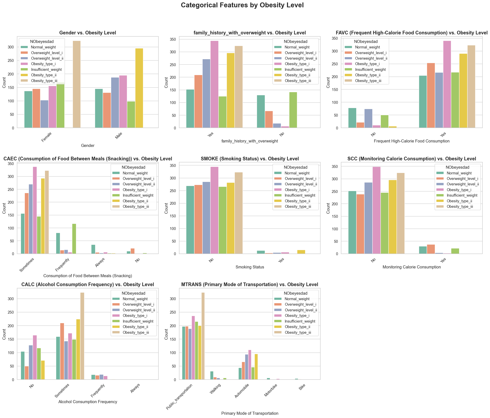
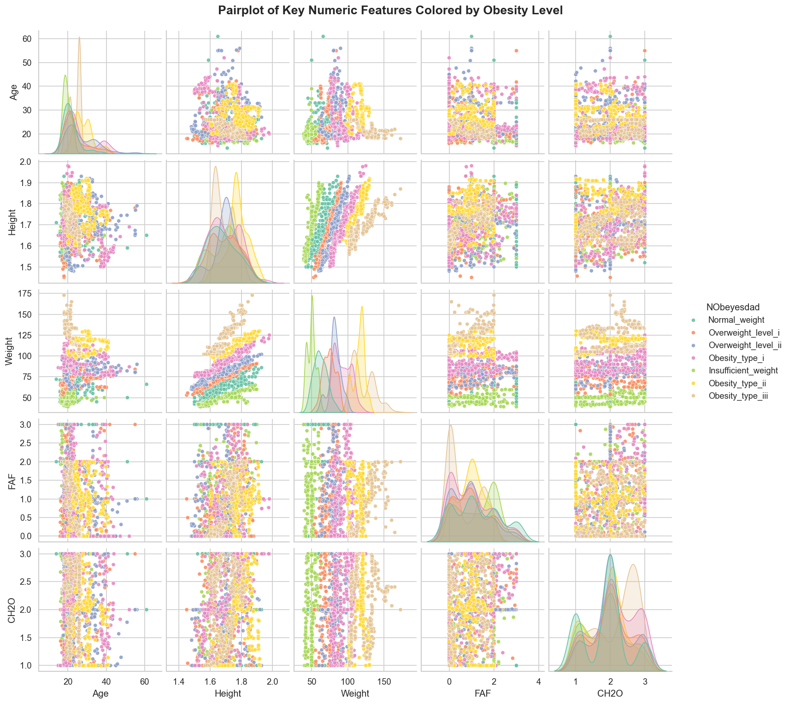

# Team 7 – Obesity Visualization Project  
**Team Members:** Nneka Asuzu, Ruchira Malhotra  
**Repository:** [GitHub Link](https://github.com/NnekaAsuzu/Obesity)  

> “Behind every data point is a person and their daily choices. Our goal is to visualize responsibly, inclusively, and with integrity.”  
> — Team 7, Obesity Visualization Project

---

## Contents
- [Team 7 – Obesity Visualization Project](#team-7--obesity-visualization-project)
  - [Contents](#contents)
  - [Purpose \& Overview](#purpose--overview)
  - [Business Question](#business-question)
  - [Goals \& Objectives](#goals--objectives)
  - [Dataset Overview](#dataset-overview)
  - [Ethical, Privacy, and Inclusivity Considerations](#ethical-privacy-and-inclusivity-considerations)
    - [Data Privacy](#data-privacy)
    - [Ethical Visualization Practices](#ethical-visualization-practices)
    - [Inclusivity \& Diversity](#inclusivity--diversity)
  - [Limitations \& Risks](#limitations--risks)
  - [Techniques \& Tools](#techniques--tools)
  - [Project Workflow \& Status](#project-workflow--status)
  - [📂 Project Folder Structure](#-project-folder-structure)
  - [Team Members \& Roles](#team-members--roles)
  - [Timeline \& Milestones](#timeline--milestones)
  - [Team Agreements](#team-agreements)
  - [Final Deliverables](#final-deliverables)
  - [Key Insights \& Findings](#key-insights--findings)
  - [Visuals Showcase](#visuals-showcase)
  - [Next Steps \& Future Work](#next-steps--future-work)
  - [Video Reflection](#video-reflection)
  - [Reproducibility Note](#reproducibility-note)
  - [References \& Links](#references--links)

---

## Purpose & Overview

This project explores and visualizes obesity trends based on **eating habits, physical activity, and demographics**.  
Goal: uncover meaningful patterns contributing to different obesity levels and communicate insights through clear, ethical, and data-driven visualizations for **public health intervention strategies**.

---

## Business Question

> What relationships exist between lifestyle habits, demographic factors, and obesity levels, and how can effective data visualization help uncover meaningful patterns for public health understanding?

---

## Goals & Objectives

- Explore distributions of numeric and categorical variables  
- Visualize relationships between lifestyle factors and obesity levels  
- Detect and handle duplicates, inconsistencies, and outliers  
- Create a reproducible, insight-driven visualization report  
- Communicate findings for **public health awareness and strategy development**

---

## Dataset Overview

- **Source:** UCI Machine Learning Repository – Obesity Dataset  
- **Records:** 2,111 individuals  
- **Attributes:** 17 features (demographics, eating habits, physical activity)  
- **Target Variable:** `NObeyesdad` (7 categories: Insufficient → Obesity Type III)  
- **Composition:** ~23% real survey data (Mexico, Peru, Colombia) + ~77% synthetic via SMOTE  
> *Note: results reflect dataset patterns, not real-world prevalence*

---

## Ethical, Privacy, and Inclusivity Considerations

### Data Privacy

- Synthetic and anonymized; no PII included  
- Simulated individuals ensure no re-identification risk

### Ethical Visualization Practices

- Neutral, respectful labeling  
- Colorblind-safe palettes and accessible formatting  
- Interpretations emphasize patterns, not individual judgment

### Inclusivity & Diversity

- Accessible design (high-contrast visuals, clear labels)  
- Fair representation of gender and age groups  
- Cultural context acknowledged for Latin American origins  
- Transparent disclosure of SMOTE balancing for fairness  

---

## Limitations & Risks

- Synthetic Data Bias (SMOTE)  
- Limited Geographic Scope (Mexico, Peru, Colombia)  
- Cohort Demographics (young adults)  
- Self-Reported Responses (recall bias)  
- Unmeasured Health Factors (thyroid issues, genetics)  
- Association, Not Causation (correlational patterns only)  

---

## Techniques & Tools

- **Languages:** Python 3  
- **Environment:** VS Code, Jupyter Notebook  
- **Libraries:** pandas, numpy, matplotlib, seaborn, plotly, scipy  
- **Data Preprocessing:** Standardized categories, removed duplicates (2,087 final records), 0 missing values  
- **Visualization Techniques:** Countplots, Boxplots, Violinplots, Histograms, KDE, Correlation Heatmaps, FacetGrids  
- **Statistical Analysis:** ANOVA (numeric features), Cramér's V (categorical), Pearson correlation  

---

## Project Workflow & Status

| Phase | Focus | Owner | Status | Key Deliverable |
|-------|-------|-------|--------|----------------|
| Week 1 | Setup, Cleaning, Initial EDA | Nneka | ✅ Completed | Cleaned dataset & initial distributions |
| Week 2 | Visualization, Interpretation, Insights, Conclusion | Nneka | ✅ Completed | Full analysis, insights, data story |
| Week 2 | Presentation prep, Showcase, Final Review | Ruchira | ✅ Completed | Presentation slides & showcase |

---

## 📂 Project Folder Structure

This visual map shows the layout and purpose of each directory and file in the project repository.

```text

Obesity_project/
│
├── 📁 data/
│   ├── 📂 raw/                 # Original, untouched dataset file
│   └── 📂 processed/           # Cleaned, deduplicated, and engineered data
│
├── 📁 notebooks/               # All Jupyter notebooks
│   └── 📄 obesity_analysis.ipynb  # Main analysis notebook with EDA, visuals, and insights
│
├── 📁 visuals/                 # Final, saved versions of all charts (PNG format)
│   ├── graph1_nobeyesdad_distribution.png
│   ├── graph2_numeric_features_distribution.png
│   ├── graph3_boxplots_numeric_by_obesity.png
│   ├── graph4_anova_numeric_strength.png
│   ├── graph5_categorical_features_distribution.png
│   ├── graph6_categorical_cramers_v.png
│   ├── graph7_correlation_heatmap.png
│   └── graph8_pairplot_optimal_obesity.png
│
├── 📁 docs/                    # Documentation, Data Dictionary, Appendix
│   └── 📄 data_dictionary.md   # Feature descriptions & coding
│
├── 📄 README.md                # Complete documentation with workflow, insights, and ethical considerations
├── 📄 requirements.txt         # List of all Python libraries needed
└── 🚫 .gitignore               # Files Git should ignore

```


## Team Members & Roles

| Name | Role | Responsibilities |
|------|------|-----------------|
| Nneka Asuzu | Project Lead & Data Science Lead | Repo setup, cleaning, EDA, visualization, insights, conclusions, README |
| Ruchira Malhotra | Presentation & Review Specialist | Slide design, showcase preparation, documentation review |

---

## Timeline & Milestones

| Week | Focus | Owner | Status |
|------|-------|-------|--------|
| Week 1 | Repo setup, data cleaning, EDA draft | Nneka | ✅ Completed |
| Week 2 | Visualization, Interpretation, Insights, Conclusion | Nneka | ✅ Completed |
| Week 2 | Presentation prep, Showcase, Final Review | Ruchira | ✅ Completed |

---

## Team Agreements

- **Communication:** Share progress on Slack after each session  
- **Collaboration:** Minimum 2 meaningful commits per week  
- **Code Consistency:** Follow PEP8; document all visualizations  
- **Reproducibility:** Notebook runs from start to finish without error  
- **Team Support:** Issues addressed within 12 hours  

---

## Final Deliverables

- **Jupyter Notebook:** `obesity_analysis.ipynb`  
- **Visuals Folder:** Final plots (PNG format)  
- **Presentation Slides:** Team 7 Showcase Deck  
- **README.md:** Complete documentation with workflow, insights, and ethical considerations  
- **Video Reflection:** Links to 3–5 minute team member videos


---

## Key Insights & Findings

- **Primary Behavioral Risk:** FAVC – the strongest behavioral driver of severe obesity  
- **Primary Protective Factor:** SCC – absence correlates with nearly all obesity cases  
- **Fixed Risk Baseline:** Family history with overweight – dominant fixed factor  
- **Gender Disparity:** Obesity Type III largely female; Obesity Type II largely male  
- **Inefficient Targets:** Age & TUE – weak predictors, de-prioritized in interventions  

---

## Visuals Showcase

Explore some of the key visualizations from our analysis:

| Visualization | Description |
|---------------|-------------|
| [](visuals/graph1_nobeyesdad_distribution.png) | Distribution of `NObeyesdad` (obesity levels) across the dataset |
| [](visuals/graph5_categorical_features_distribution.png) | Distributions of key categorical features (e.g., FAVC, SCC, CAEC, Gender) |
| [](visuals/graph2_numeric_features_distribution.png) | Histograms & KDEs showing individual distributions of numeric features |
| [](visuals/graph3_boxplots_numeric_by_obesity.png) | Comparison of numeric features by obesity level (Boxplots) |
| [](visuals/graph7_correlation_heatmap.png) | Correlation matrix showing relationships between numeric features |
| [](visuals/graph8_pairplot_optimal_obesity.png) | Pairplot showing interactions between key numeric features (Height, Weight, Age, FAF, CH2O) |

Visualizations highlight the interplay of lifestyle, demographics, and obesity levels, providing quick insight into patterns discovered during EDA.

---

## Next Steps & Future Work

Based on our EDA findings, Team 7 recommends the following next steps for further analysis and actionable insights:

1. **Feature Engineering & Clustering**  
   - Create composite behavioral indices to combine related eating and activity metrics.  
   - Explore patterns in numeric features using K-Means or Hierarchical Clustering to see if Gender and Obesity Level groupings emerge.  

2. **Predictive Modeling**  
   - Train a classification model (Random Forest or XGBoost) using key predictors: FAVC, SCC, Family History, and Gender.  
   - Goal: Accurately predict obesity categories (`NObeyesdad`) and quantify feature importance.  

3. **Model Interpretation & Validation**  
   - Use feature importance to validate EDA findings.  
   - Confirm whether FAVC and SCC are indeed the strongest behavioral drivers.  
   - Leverage model insights to refine public health interventions.  

4. **Targeted Visualization & Deep-Dive Analysis**  
   - Investigate non-linear patterns in categorical features (e.g., CAEC and CALC ‘Sometimes’ category).  
   - Refine visualizations and messaging for more effective intervention targeting.


---

## Video Reflection


- **[Nneka’s Reflection Video](https://www.youtube.com/watch?v=kH4jbCsob5c)** – Covers the project overview, key insights, challenges (including synthetic data limitations), cross-validating patterns using multiple visualizations, and personal contributions to team workflow.

- **[Ruchira’s Reflection Video]([https://drive.google.com/drive/u/4/folders/13lUXUsmpkvXNmJhHIjUEJ-gAeptPxG_r](https://youtu.be/jazVDnjxq_k))** – Team member reflection on learning experience, challenges, and role in the project. 

---


## Reproducibility Note

- All data cleaning, preprocessing, and EDA steps are scripted and deterministic  
- Dataset loaded from fixed source; no random sampling or modeling used  
- Results and visualizations are fully reproducible by any team member  

---

## References & Links

- **Dataset:** [UCI Repository](https://archive.ics.uci.edu/dataset/544/estimation+of+obesity+levels+based+on+eating+habits+and+physical+condition)  
- **Team Project Guidelines:** UofT DSI  
