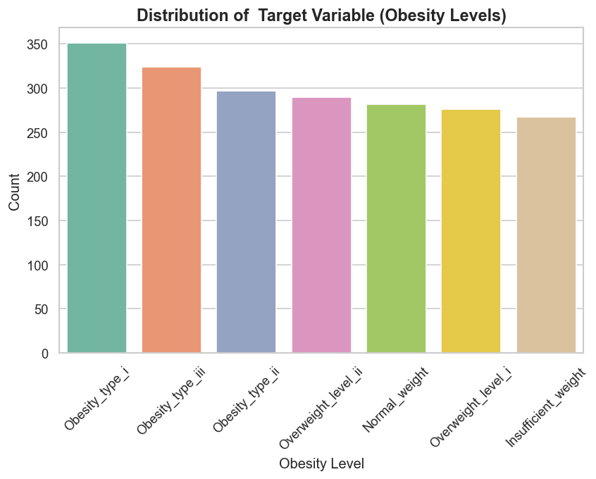
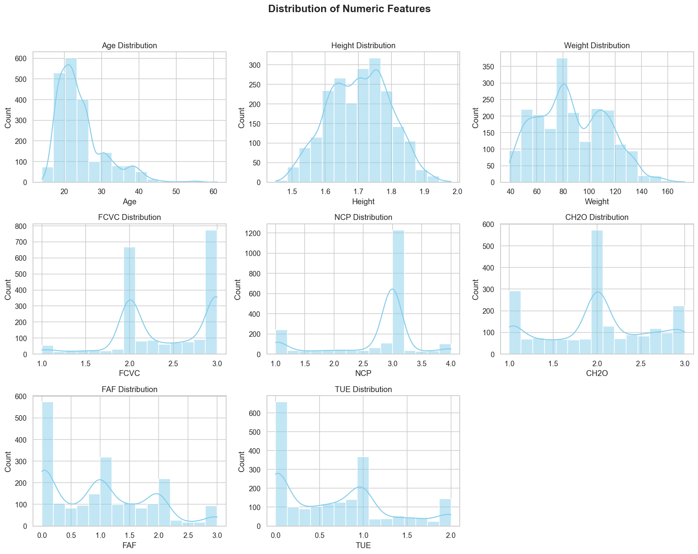
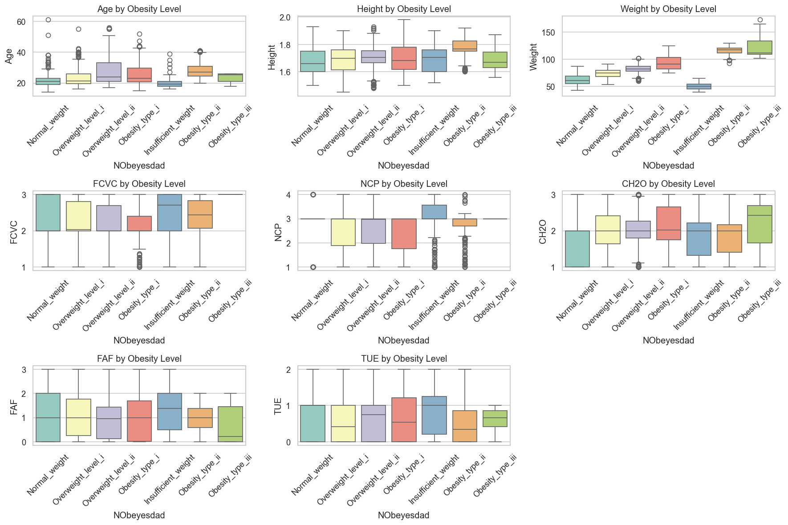
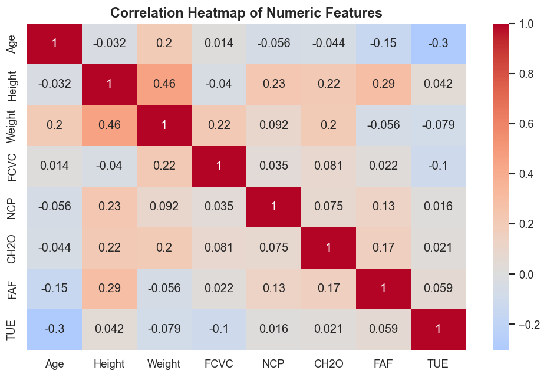
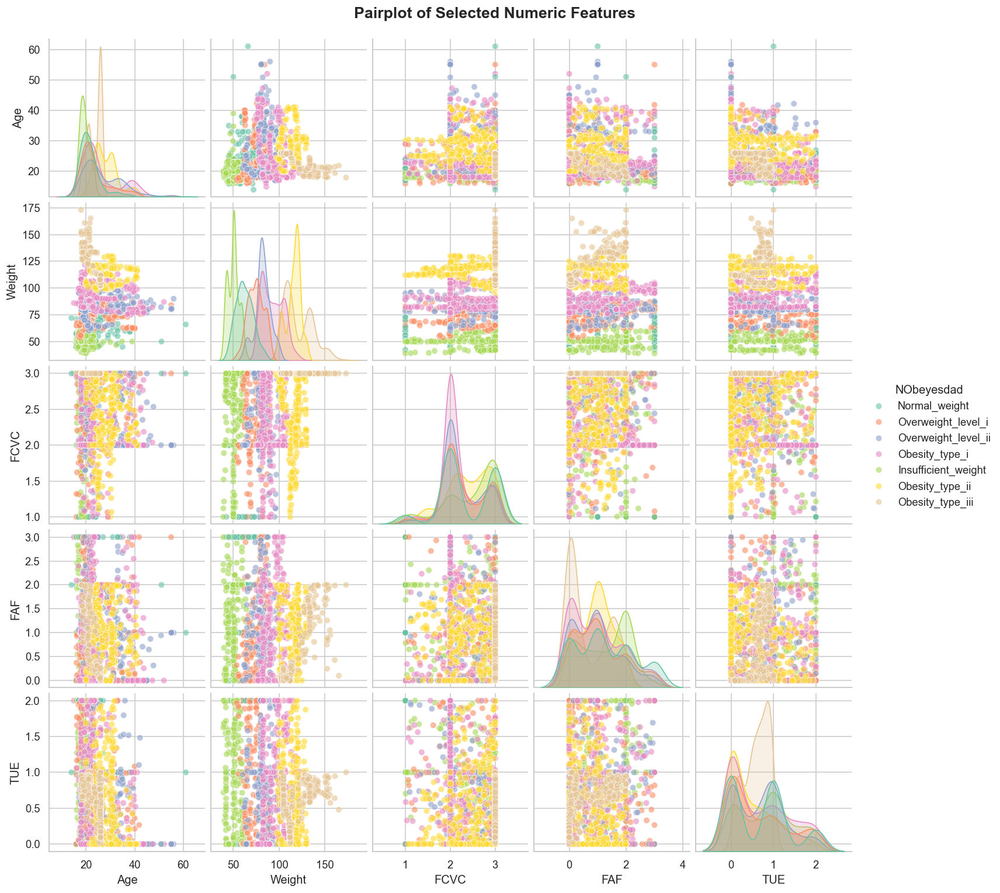

# Team 7 – Obesity Visualization Project  
**Team Members:** Nneka Asuzu, Ruchira Malhotra  
**Repository:** [GitHub Link](https://github.com/NnekaAsuzu/Obesity)  

---

## Contents
- [Team 7 – Obesity Visualization Project](#team-7--obesity-visualization-project)
  - [Contents](#contents)
  - [Purpose \& Overview](#purpose--overview)
  - [Business Question](#business-question)
  - [Goals \& Objectives](#goals--objectives)
  - [Dataset Overview](#dataset-overview)
  - [Ethical, Privacy, and Inclusivity Considerations](#ethical-privacy-and-inclusivity-considerations)
    - [Data Privacy](#data-privacy)
    - [Ethical Visualization Practices](#ethical-visualization-practices)
    - [Inclusivity \& Diversity](#inclusivity--diversity)
  - [Techniques \& Tools](#techniques--tools)
  - [Project Workflow \& Status](#project-workflow--status)
  - [📂 Project Folder Structure](#-project-folder-structure)
  - [Team Members \& Roles](#team-members--roles)
  - [Timeline \& Milestones](#timeline--milestones)
  - [Team Agreements](#team-agreements)
  - [Final Deliverables](#final-deliverables)
  - [Key Insights \& Findings](#key-insights--findings)
  - [Visuals Showcase](#visuals-showcase)
  - [Future Work](#future-work)
  - [Video Reflection](#video-reflection)
  - [Reproducibility Note](#reproducibility-note)
  - [References \& Links](#references--links)

---

## Purpose & Overview
This project focuses on **exploring and visualizing obesity trends** based on eating habits, physical activity, and demographic factors.  
Our goal is to uncover meaningful patterns contributing to different obesity levels and communicate insights through **clear, ethical, and data-driven visualizations**.

---

## Business Question
> What relationships exist between lifestyle habits, demographic factors, and obesity levels — and how can visualization help uncover meaningful patterns in this population?

---

## Goals & Objectives
- Explore distributions of numeric and categorical variables  
- Visualize relationships between **lifestyle factors** and **obesity levels**  
- Detect and handle duplicates, inconsistencies, and outliers  
- Create a **reproducible, insight-driven visualization notebook**  
- Communicate findings for **public health and wellness awareness**

---

## Dataset Overview
- **Source:** [UCI Machine Learning Repository – Obesity Dataset](https://archive.ics.uci.edu/ml/datasets/Estimation+of+Obesity+Levels+Based+on+Eating+Habits+and+Physical+Condition)  
- **Records:** 2,111 individuals  
- **Attributes:** 17 features (demographics, eating habits, physical activity)  
- **Target Variable:** `NObeyesdad` (7 obesity categories: Insufficient → Obesity Type III)  
- **Composition:** ~23% real survey data (Mexico, Peru, Colombia) + ~77% synthetically balanced via SMOTE.  
  *Note: results reflect dataset patterns, not real-world prevalence*

---

## Ethical, Privacy, and Inclusivity Considerations

### Data Privacy
- Synthetic and anonymized dataset; no personally identifiable information (PII)  
- Simulated individuals ensure **no re-identification risk**

### Ethical Visualization Practices
- Neutral, respectful labeling  
- Colorblind-safe palettes and accessible formatting  
- Interpretations emphasize **patterns, not individual judgment**

### Inclusivity & Diversity
- Accessible design (high-contrast visuals, clear labels)  
- Fair representation of gender and age groups  
- Cultural context acknowledged for Latin American origins  
- Transparent disclosure of SMOTE balancing for fairness  

> These principles ensure the project reflects inclusivity, fairness, and respect for data diversity.

---

## Techniques & Tools
**Languages:** Python 3  
**Environment:** VS Code, Jupyter Notebook  

**Libraries Used:** `pandas`, `numpy`, `matplotlib`, `seaborn`, `plotly`, `scipy`

**Data Preprocessing:**  
- Standardized categorical variables  
- Converted datatypes  
- Removed 24 duplicate rows  
- Verified final dataset = 2,087 unique records  
- Confirmed 0 missing values  

**Visualization Techniques:**  
- Countplots for categorical feature distributions  
- Boxplots & Violinplots for obesity level comparisons  
- Histograms and KDE plots for numeric variables  
- Correlation Heatmaps for feature relationships  
- FacetGrids for multi-variable visualization  

---

## Project Workflow & Status

| Phase | Notebook Section | Status | Key Deliverable |
| :--- | :--- | :--- | :--- |
| Setup & Imports | Step 1 | ✅ Completed | Core libraries & environment setup |
| Data Inspection | Step 2 | ✅ Completed | Identified duplicates, missing values |
| Data Cleaning | Step 3 | ✅ Completed | Cleaned dataset → 2,087 records |
| EDA & Distributions | Step 4b–4c | ✅ Completed | Visualized Age, Weight, FAF, TUE |
| Relationship Analysis | Step 4d–4e | ✅ Completed | Boxplots & Heatmap confirm FAF & Weight as key predictors |
| Data Storytelling | Final Conclusion | ✅ Completed | Identified Age, Weight, Gender, FAF, TUE as top influencers |
| Future Work | Future Steps | 💡 Planned | Feature engineering & predictive modeling |

---


## 📂 Project Folder Structure

This visual map shows the layout and purpose of each directory and file in the project repository.

```text

Obesity_Project/
│
├── 📁 data/
│   ├── 📂 raw/                 # Original, untouched dataset file
│   └── 📂 processed/           # Cleaned, deduplicated, and engineered data
│
├── 📁 notebooks/               # All Jupyter notebooks
│   └── 📄 obesity_analysis.ipynb  # Main analysis notebook
│
├── 📁 visuals/                 # Final, saved versions of all charts (PNGs/JPEGs)
│
├── 📁 docs/                    # Documentation, Data Dictionary, Appendix
│   └── 📄 data_dictionary.md   # Feature descriptions & coding
│
├── 📁 reports/                 # Final presentation slides or PDF reports
│
├── 📄 README.md                # The project entry point and documentation
├── 📄 requirements.txt         # List of all Python libraries needed
└── 🚫 .gitignore               # Files Git should ignore

```

## Team Members & Roles

| Name | Role | Responsibilities |
|------|------|------------------|
| **Nneka Asuzu** | Project Lead & Data Exploration Specialist | Repo setup, data cleaning, EDA, visualization design, documentation |
| **Ruchira Malhotra** | Insights & Presentation Lead | Insight summarization, presentation slides, interpretation, README refinement |

> Both contributed equally to documentation, commits, and PR reviews.

---

## Timeline & Milestones

| Week | Focus | Owner | Status |
| :--- | :--- | :--- | :--- |
| Week 1 | Repo setup, data cleaning, EDA draft | Nneka | ✅ Completed |
| Week 2 | Insights, presentation prep, showcase | Ruchira | ✅ Completed |

---

## Team Agreements

| Area | Agreement |
|------|-----------|
| Communication | Share progress on Slack after each session |
| Collaboration | Minimum 2 meaningful commits per week |
| Code Consistency | Follow PEP8; each visualization documented |
| Reproducibility | Notebook runs cleanly from start to finish |
| Team Support | Issues discussed within 12 hours |

---

## Final Deliverables
- **Jupyter Notebook:** `obesity_analysis.ipynb`  
- **Visuals Folder:** Final plots (PNG format)  
- **Presentation Slides:** Team 7 Showcase Deck  
- **README.md:** Complete documentation with workflow, insights, and ethical considerations  
- **Video Reflection:** Links to 3–5 minute team member videos  

---

## Key Insights & Findings
- **Physical Activity (FAF):** Strong inverse correlation with obesity  
- **Screen Time (TUE):** Positively correlates with higher obesity levels  
- **Gender Split:** Obesity Type II male-dominated; Type III slightly higher among females  
- **Age Trend:** Median age increases with higher obesity classes  
- **Lifestyle Factors:** High-calorie intake and low activity drive BMI upward  

> Obesity is influenced by the **interaction between lifestyle habits and demographics**, highlighting the need for holistic wellness strategies.

---


## Visuals Showcase

Explore some of the key visualizations from our analysis. Click to view full resolution:

| Visualization | Description |
|---------------|-------------|
| [](visuals/graph1_nobeyesdad_distribution.png) | Distribution of `NObeyesdad` (obesity levels) across the dataset |
| [](visuals/graph2_numeric_features_distribution.png) | Histograms & KDEs showing distributions of Age, BMI, FAF, TUE |
| [](visuals/graph3_boxplots_numeric_by_obesity.png) | Comparison of numeric features by obesity level (Boxplots) |
| [](visuals/graph4_correlation_heatmap.png) | Correlation matrix showing relationships between numeric features |
| [](visuals/graph5_pairplot_selected_features.png) | Pairplot showing interactions between key numeric features |

> Visualizations highlight the **interplay of lifestyle, demographics, and obesity levels**, providing quick insight into patterns discovered during EDA.


---

## Future Work
1. Feature Engineering: Derive metrics like *Sedentary Index* (FAF + TUE)  
2. Predictive Modeling: Classifiers (Random Forest, XGBoost) for obesity level  
3. Model Interpretation: Confirm EDA hypotheses with feature importance  
4. Interactive Dashboard: Build Plotly/Dash interface for public health storytelling  


---

## Video Reflection
- [Nneka’s Reflection Video](#)  
- [Ruchira’s Reflection Video](#)  

---

## Reproducibility Note
- All data cleaning, preprocessing, and EDA steps are scripted and deterministic  
- Dataset loaded from fixed source; no random sampling or ML modeling performed  
- Results and visualizations fully reproducible by any team member  

---

## References & Links
- [Dataset: UCI Repository](https://archive.ics.uci.edu/ml/datasets/Estimation+of+Obesity+Levels+Based+on+Eating+Habits+and+Physical+Condition)  
- [Team Project Guidelines (UofT DSI)](https://github.com/UofT-DSI/team_project)  

---

> “Behind every data point is a person and their daily choices. Our goal is to visualize responsibly, inclusively, and with integrity.”  
> — Team 7, Obesity Visualization Project

